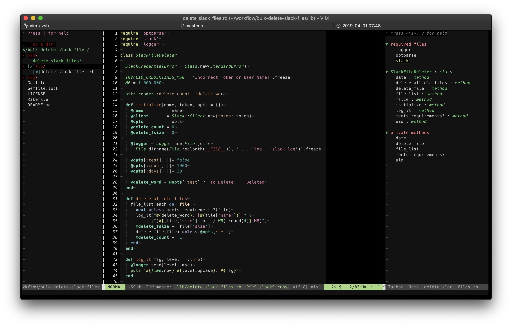

# My Vimfiles
All of my vim runtime files. Here be dragons.

My local copy of vim is running `version 8` on Mac, but on our company's system,
we're running `version 7.{1,3,4}` on Linux. I've spent time making sure this
repository works without errors no matter what `vim` version I'm running; the
only difference is, some plugins have to be disiabled, as they aren't compatible
with lower versions of vim. Full disclosure, I have not tested any of this on
Windows. You've been warned.

Here's what my `vim` setup looks like. In this screenshot, you can see
[Tagbar](https://github.com/majutsushi/tagbar.git),
[NERDTree](https://github.com/scrooloose/nerdtree.git),
[Easteregg Colorscheme](https://github.com/evanthegrayt/vim-easteregg.git), and
[Airline with a bunch of integrated plugins](https://github.com/vim-airline/vim-airline.git).
I'm using [iTerm2](https://www.iterm2.com/) on MacOS, with
[italics enabled](https://github.com/evanthegrayt/dotfiles/blob/master/resource/xterm-256color.terminfo#L3),
and with the [Hack font](https://sourcefoundry.org/hack/).



### Installation
I highly doubt you want to use my exact configuration, so I recommend finding
the files/lines of code you want and copy them into your own `.vim` directory,
but if you do want my exact settings, clone the repository. Make sure to use
`--recursive` if you want to clone the plugins I use as well.

```bash
git clone --recursive https://github.com/evanthegrayt/vimfiles.git ~/.vim
```

Once cloned, if your vim version is less than 7.4, you'll need to link the
`vimrc` file to your home directory, as a dotfile.

```bash
ln -s ~/.vim/vimrc ~/.vimrc
```

Be forewarned that I use `vim8` with packages, but I've configured this
repository to work with older versions, using
[pathogen](https://github.com/tpope/vim-pathogen). Because of this, plugins will
be located in `pack/plugins/{start,opt}`, NOT `bundle/`.

# FAQ
At least, I assume these would be frequently asked...
### Why do colors look weird?
You probably don't have italics enabled in your terminal. Either
[research how to enable them](https://github.com/evanthegrayt/dotfiles/blob/master/resource/xterm-256color.terminfo#L3),
or turn off italics by changing this line in `vimrc`:

```vim
let g:easteregg_use_italics = 1
```

...to this:

```vim
let g:easteregg_use_italics = 0
```

...or just delete the line entirely.

### Not all configurations are in your vimrc; where are they?
Functions, autocommands, and gui settings are under `pack/settings/start` to
make my `vimrc` cleaner, as I rarely edit these.

Also, a lot of people put file-type related settings -- such as indentation,
autocommands, etc. -- in their `vimrc` files, but `vim` provides directories for
these types of situations, getting rid of ugly conditionals cluttering your
`vimrc`. I utilize [these
directories](http://www.panozzaj.com/blog/2011/09/09/vim-directory-structure/),
so [indention](./indent/), [file type plugins](./ftplugin), etc., are located in
the appropriate directories.

### Why do I have no plugins?
You probably didn't clone with the `--recursive` option, as stated above.

### Why isn't my vimrc being loaded?
You're probably running an older version of `vim`, which doesn't know to check
the `.vim` directory for a `vimrc` file. As stated above, you need to link it to
your home directory.

### Why do your additions to ctags not show up in tagbar?
To use the [custom tags I've added to
tagbar](https://github.com/evanthegrayt/vimfiles/blob/master/vimrc#L181), you
need to get the tags from my [ctags
directroy](https://github.com/evanthegrayt/dotfiles/tree/master/resource/ctags.d)
and put them in a directory called `~/.ctags.d`.  I'm also using
[Unversal Ctags](https://github.com/universal-ctags/ctags); if you're using [Exuberant
Ctags](http://ctags.sourceforge.net/), you need all of the tags in one file
named `~/.ctags`. If you need more info, please read about those programs.

## Reporting Bugs
These are just my config files, so there shouldn't be (m)any bugs, but if you
find any, please [submit an
issue](https://github.com/evanthegrayt/vimfiles/issues/new).

